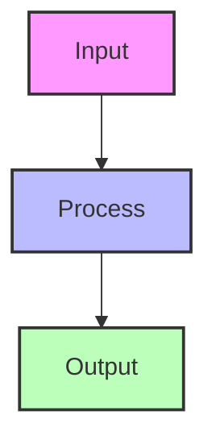

# Engineering Blog Writing Instructions

**Purpose**: Generate human-sounding, engaging engineering blog posts for adityajindal.com

**File Format**: MDX (`.mdx` extension)
**Frontmatter Required**: title, description, date, tags

---

## Voice & Tone

### Core Principles
- **First-person perspective**: Write from "I" — your experience, your decisions
- **Direct and concise**: Short sentences, short paragraphs. 1-3 sentences per paragraph max
- **Show, don't tell**: Use concrete examples, numbers, and real code instead of abstract statements
- **Problem-first narrative**: Start with the problem, then the solution, then the lessons learned
- **No fluff**: Every paragraph should advance the narrative or explain something useful
- **Technical but accessible**: Assume technical audience but explain the "why" not just the "how"

### Style Characteristics
- **Contrarian where appropriate**: "Everyone said X, I did Y anyway"
- **Honest about failures**: "Here's what I'd do differently"
- **Metrics-driven**: Include real numbers when possible (latency, user counts, percentages)
- **Practical over theoretical**: Focus on what shipped, what worked, what didn't

---

## Content Structure

### Standard Sections (in order)

1. **Hook (2-3 sentences)**
   - State the problem directly
   - Why it matters
   - What makes it interesting

   Example:
   ```
   The problem was simple: I live with roommates, and we have submeters. 
   Every month, someone has to sit down with the meter readings, do the math, 
   and figure out who owes what. Nobody wants to do it.
   ```

2. **Solution Overview (1-2 sentences)**
   - What you built
   - The surprising result

   Example:
   ```
   I built SplitWatt to solve that. It reached 129 countries. 9,000+ impressions. 
   5.5% click-through rate — about three times the industry average.
   ```

3. **Technical Sections (2-4 sections)**
   - Each section focuses on ONE key technical decision or insight
   - Include real code snippets
   - Explain the trade-offs
   - Use subheadings like "The Architecture at a Glance", "Reading the Right Context", etc.

4. **What I'd Do Differently (always include)**
   - 2-3 bullet points
   - Honest reflection on mistakes or missed opportunities
   - Broader lesson

   Example:
   ```
   The biggest thing I underestimated was Salesforce's DOM stability. 
   Their Lightning Experience renders a lot of content dynamically, and 
   selectors that worked last week stopped working after a routine update.

   I'd also invest earlier in an evaluation layer. We ended up building one, 
   but retrofitting evaluation onto a shipping feature is harder than building it in from the start.
   ```

5. **Broader Takeaway (1-2 sentences)**
   - The universal lesson
   - What readers can apply to their own work

   Example:
   ```
   Build something people search for. Make sure they can find it. Make sure it works when they do.

   That's the whole playbook.
   ```

---

## Frontmatter Format

```yaml
---
title: "Engaging, Specific Title With Numbers or Metrics"
description: Two-sentence summary that includes the problem and the surprising result.
date: 2025-XX-XX
tags:
  - tag1
  - tag2
  - tag3
---
```

**Title Examples:**
- "150ms on CPU: How I Built Soteira's Real-Time Video Inference Pipeline"
- "How SplitWatt Reached 129 Countries Without Spending a Rupee on Marketing"
- "Stop Paying for the Same LLM Response Twice"

**Description Examples:**
- "Everyone said I needed a GPU. I shipped 150ms real-time video inference on CPU anyway — here's the 3-gate pipeline architecture that made it possible."
- "I built a tool to split my electricity bill. Nine thousand impressions and 129 countries later, here's what I learned about building something people actually search for."

---

## Code Snippets

### Requirements
- **Real code only**: No pseudocode
- **Include imports**: Show the full context
- **Add comments**: Explain non-obvious parts inline
- **Consistent style**: Match existing codebase conventions (TypeScript/Python, etc.)
- **Relevant only**: Only include code that illustrates the point being made

### Code Block Format
```typescript
// Brief comment explaining what this does
import { X } from 'library';

function example() {
  // More specific comments
  const result = doThing();
  return result;
}
```

### When to Use Code
- To show the actual implementation
- To demonstrate a clever optimization
- To illustrate a decision point
- To provide copy-pasteable value

**Never use code** to:
- Explain a concept that can be described in text
- Show trivial boilerplate
- Fake complexity

---

## TypographyMark Component

Use `TypographyMark` sparingly — maximum 1-2 times per post. Only for the most important insight.

```mdx
import { TypographyMark } from "@/components/ui/typography";

<TypographyMark>Real-time inference is fundamentally a filtering problem before it's a prediction problem.</TypographyMark>
```

### When to Use TypographyMark
- The core thesis of the article
- A counterintuitive insight
- The most important technical insight

### When NOT to Use
- Routine explanations
- Multiple times in quick succession
- For emphasis only (not insight)

---

## Mermaid Diagrams

Mermaid is supported in this blog. Use diagrams to visualize:
- Architecture flows
- Data pipelines
- System components
- Decision trees
- Timeline/sequence

### Diagram Format


### Best Practices
- **One diagram per major section**: Don't overwhelm
- **Keep it simple**: 5-10 nodes max per diagram
- **No inline style directives**: Never use `style NodeName fill:#hex` — hardcoded colors break dark mode. Let the theme handle colors entirely.
- **Caption it**: Add text explanation before/after
- **Match the narrative**: Diagram should reinforce the text, not replace it

### Diagram Types to Use
- `flowchart TD`: For architecture, data flow
- `sequenceDiagram`: For API calls, user flows
- `timeline`: For project phases, evolution
- `mindmap`: For concepts, relationships

### When NOT to Use Diagrams
- Simple processes that can be described in 1-2 sentences
- Overly complex systems (simplify first)
- Purely technical implementation details (use code instead)

---

## Tags

Use 4-6 relevant tags from this list (or add new ones if truly needed):

**Common tags:**
- python, typescript, javascript
- nextjs, react
- ai, llm, computer-vision
- performance, optimization
- infrastructure, architecture
- chrome-extension
- security
- open-source
- indie-hacking
- seo
- database

**Format:** Lowercase, hyphenated for multi-word tags

---

## Things to AVOID

### ❌ Don't Write Like This
- Long meandering paragraphs
- Abstract concepts without concrete examples
- "In this article we will..." intros
- Lists of "what we learned" without specifics
- Fake humble-brags
- Exaggerated claims without numbers
- Overusing emphasis (bold, italics, TypographyMark)

### ❌ Don't Include
- Table of contents (auto-generated)
- Author bio (not needed)
- Social sharing buttons (not needed)
- Generic "thanks for reading" ending
- Outdated tech without noting it
- Links to unrelated content

### ❌ Code Smells
- `// TODO` comments
- `// FIXME` comments
- Placeholder text in code
- Unclear variable names
- Missing error handling in real code

---

## Quality Checklist

Before finalizing, ensure:

- [ ] First-person narrative throughout
- [ ] Short paragraphs (1-3 sentences max)
- [ ] Concrete numbers/metrics included
- [ ] Real code with imports
- [ ] "What I'd Do Differently" section present
- [ ] Broader takeaway at the end
- [ ] TypographyMark used ≤2 times
- [ ] Mermaid diagrams support the narrative (don't overwhelm)
- [ ] Frontmatter complete and accurate
- [ ] No fluff or filler paragraphs
- [ ] Every section advances the narrative
- [ ] Tags are relevant and properly formatted

---

## Examples for Reference

### Good Hooks
1. "The problem was simple: I live with roommates, and we have submeters. Every month, someone has to sit down with the meter readings, do the math, and figure out who owes what. Nobody wants to do it."

2. "When I started building Soteira, the assumption from most people I talked to was: *you need a GPU for anything real-time with ML*."

3. "Sales reps spend somewhere between 20–30% of their day on CRM updates. That's not a complaint — it's a number that shows up in every sales productivity study, and it's been true for years."

### Good Section Transitions
1. "Before any of the distribution story, there's a technical story."
2. "The hardest part wasn't the LLM work — it was building reliable integrations."
3. "One thing that surprised me: you don't need the Salesforce API to read data from Salesforce."

### Good Closing Lines
1. "Build something people search for. Make sure they can find it. Make sure it works when they do. That's the whole playbook."
2. "The broader lesson: when everyone tells you a thing requires hardware you don't have, it's worth asking whether the problem is actually the problem — or whether you're solving the expensive version of it when a cheaper, smarter version exists."
3. "The model is the easy part. The integrations, the data normalization, the edge cases — that's where the work actually lives."

---

## Post-Generation Review

After generating content, ask:
1. Does this sound like something a human engineer would write? (Not marketing copy, not AI-generated fluff)
2. Is every technical claim backed by real code or numbers?
3. Would this be useful to someone solving a similar problem?
4. Is it concise? Could you cut 20% without losing meaning?
5. Does it end with a broader lesson readers can apply?

---

## When in Doubt

- **Shorter is better**: If a paragraph is 4+ sentences, split it
- **Specific > General**: Replace "optimizations improved performance" with "LCP dropped from 2.3s to 1.1s"
- **Stories > Lectures**: Frame everything as a problem you solved, not a lesson you're teaching
- **Honest > Perfect**: Admit mistakes and uncertainties
- **Code > Text**: If code explains it better than text, use code
